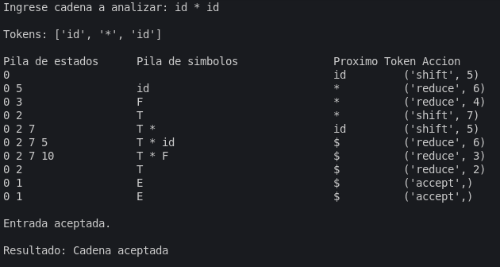
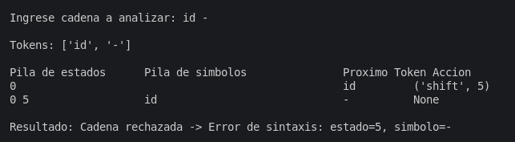
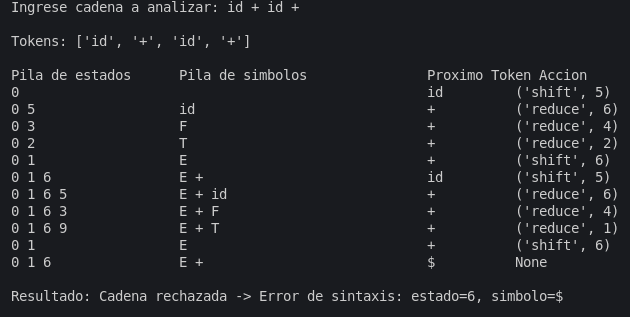
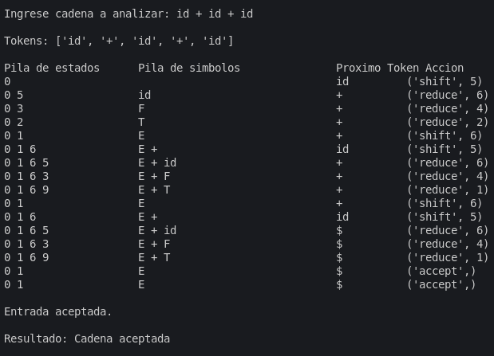

# Analizador ascendente 
- Tokeniza una cadena de entrada simple y realiza el parsing utilizando dos pilas (pila de estados y pila de simbolos).
- Imprime una traza paso a paso (pila de estados, pila de símbolos, token siguiente y accion tomada) y al final informa si la cadena fue aceptada o rechazada.

## Gramática soportada
Las producciones numeradas en el script son (comentadas en el código):

1. E -> E + T
2. E -> T
3. T -> T * F
4. T -> F
5. F -> ( E )
6. F -> id

Estas producciones fueron usadas para construir (manualmente en el código) las tablas ACTION/GOTO que gobiernan el parser.


## Uso


```bash
python3 TercerPunto/ascedente.py TercerPunto/text.txt
```


## Salida / Traza
La traza imprime columnas:
- `Pila de estados`: los estados numéricos del autómata (cima a la derecha).
- `Pila de simbolos`: los símbolos apilados (terminales y no terminales).
- `Proximo Token`: lookahead actual (el siguiente token sin consumir).
- `Accion`: la acción tomada (ej. `('shift', 5)`, `('reduce', 6)`, `('accept',)` o `None` si no hay acción definida).


# Cambios de Gramatica para LL(1)

## Eliminando recursividad por la izquierda

Gramatica original: 

E -> E + T | T
T -> T * F | F
F -> ( E ) | id

Gramatica transformada mediante:
A → A α₁ | A α₂ | … | A αₘ | β₁ | β₂ | … | βₙ 

A  → β₁ A' | β₂ A' | … | βₙ A'
A' → α₁ A' | α₂ A' | … | αₘ A' | ε 
---

E  -> T E'
E' -> + T E' | ε
T  -> F T'
T' -> * F T' | ε
F  -> ( E ) | id

# Generar Conjuntos para la nueva gramatica usando generar_conjuntos.py:

--- PRIMEROS ---
PRIMEROS(+) = {'+'}
PRIMEROS(*) = {'*'}
PRIMEROS(() = {'('}
PRIMEROS()) = {')'}
PRIMEROS(id) = {'id'}
PRIMEROS(E) = {'(', 'id'}
PRIMEROS(T) = {'(', 'id'}
PRIMEROS(E') = {'+', 'ε'}
PRIMEROS(F) = {'(', 'id'}
PRIMEROS(T') = {'*', 'ε'}

--- SIGUIENTES ---
SIGUIENTES(E) = {')', '$'}
SIGUIENTES(T) = {'+', ')', '$'}
SIGUIENTES(E') = {')', '$'}
SIGUIENTES(F) = {'+', ')', '*', '$'}
SIGUIENTES(T') = {'+', ')', '$'}

--- PREDICCIÓN ---
PRED(E -> T E') = {'(', 'id'}
PRED(E' -> + T E') = {'+'}
PRED(E' -> ε) = {')', '$'}
PRED(T -> F T') = {'(', 'id'}
PRED(T' -> * F T') = {'*'}
PRED(T' -> ε) = {'+', ')', '$'}
PRED(F -> ( E )) = {'('}
PRED(F -> id) = {'id'}

# Pruebas del analizador:

## Input:

Cadena: id * id

## Output:


## Input 

Cadena: id -

## Output




## Input

Cadena: id + id +

## Output:


## Input:

Cadena: id + id + id

## Output:
